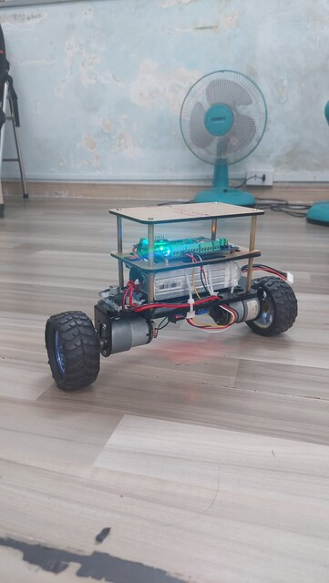
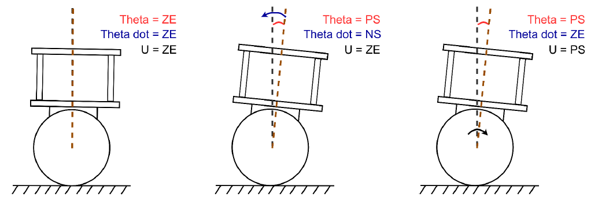
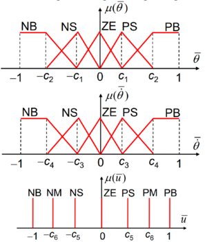
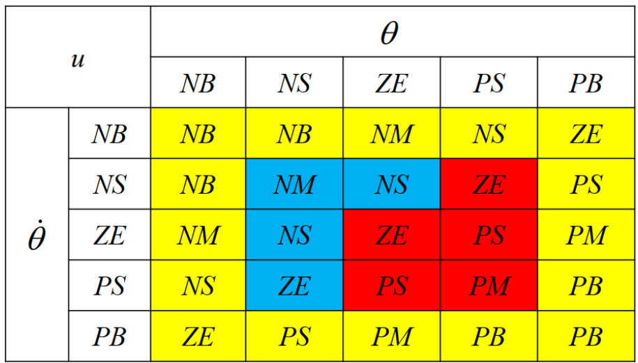
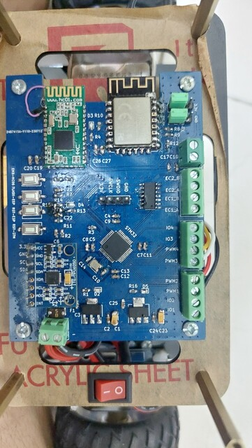

# Balancing-Robot
Design a two-wheeled self-balancing robot with DC motor from scratch with Fuzzy logic controller, using a complementary filter to determine the tilt angle of the robot with an IMU.

# Fuzzy logic controller implement
The robot system has two input variables: tilt angle and tilt rate, with the output being the motor rotation speed.

Based on that, I designed fuzzy control rules for the robot system:

Linguistic values of input and output variables:

Fuzzy control rule table for the robot:

# Complementary filter:

The complementary filter combines signals from the accelerometer and gyroscope based on frequency. The accelerometer performs better at low frequencies (long-term) to determine the tilt angle, while the gyroscope provides accurate data at high frequencies (short-term). This filter is easy to implement and is often used in embedded systems due to its simplicity.

# Hardware:

Self-designed microcontroller board with STM32F103 read data from MPU6050 and control two DC motors with PWM signal through H Bridge, BLE HC-08 and ESP8266 for wireless control or tunning the robot:

