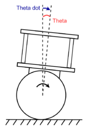

# Balancing-Robot
Design a two-wheeled self-balancing robot with DC motor from scratch with Fuzzy logic controller, using a complementary filter to determine the tilt angle of the robot with an IMU.

#Fuzzy logic implement
The robot system has two input variables: tilt angle and tilt rate, with the output being the motor rotation speed.

Based on that, I designed fuzzy control rules for the robot system.

Linguistic values of input and output variables.

Fuzzy control rule table for the robot:

